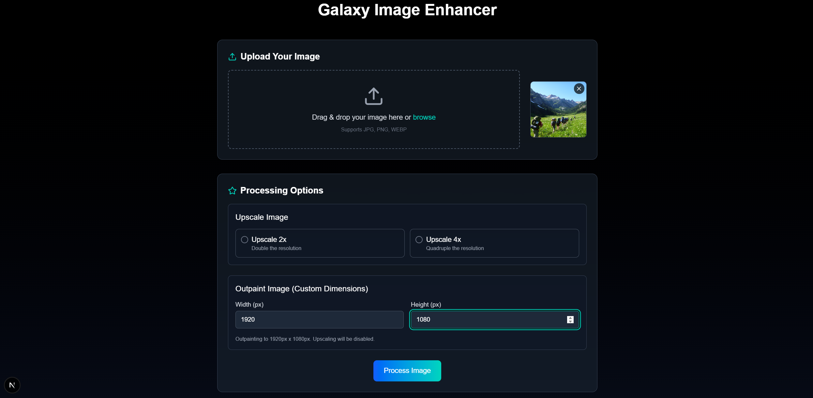

# Galaxy Image Enhancer

A Next.js application that enhances images using AI-powered upscaling and outpainting techniques. This application integrates with a Fast backend API for image processing.

## Features

- **Image Upscaling**: Increase image resolution by 2x or 4x with AI enhancement
- **Image Outpainting**: Expand image boundaries to custom dimensions
- **Drag-and-Drop**: Upload images directly to the application
- **Responsive Design**: Works seamlessly on both desktop and mobile devices

## Screenshots

| Original Image(846x635) | Outpainted Result(1920x1080) |
|:---:|:---:|
|  |  |


## Getting Started

### Prerequisites

- Node.js 16.x or higher
- Backend API server running on http://localhost:8000

### Frontend Setup

Run the development server:

```bash
npm run dev
```

Open [http://localhost:3000](http://localhost:3000) with your browser to see the result.

### Backend Integration

This application integrates with a Flask backend API that provides image processing capabilities. The backend API endpoints are:

- `POST /upscale` - For image upscaling with options for scale factor, output scale
- `POST /outpaint` - For image outpainting with options for target width and height

The integration is handled by the API service in `lib/api.ts`, which provides functions for:

- `upscaleImage()` - Sends images to the upscaling endpoint
- `outpaintImage()` - Sends images to the outpainting endpoint

Both functions handle the conversion of data URLs to file objects, form data creation, and error handling.

### Usage

1. Upload an image using drag-and-drop or the file selector
2. Choose processing options:
   - For upscaling: Select 2x or 4x
   - For outpainting: Enter target width and height
3. Click "Process Image" to send the image to the backend for processing
4. View and download the processed image

### Troubleshooting

- If you encounter connection errors, ensure the backend server is running on port 8000
- For image processing errors, check the backend server logs for more details
- Large images may take longer to process; be patient during the processing stage

### Credits
- This is a work done for Samsung Prism 2024-2025 in collaboration with Vellore Institute of Technology.
- Thanks to our mentors Mr. Gokul GN(Samsung Research Institute, Bengaluru) and Dr. Ranjeet(Vellore Institute of Technology, Chennai) for their guidance.
